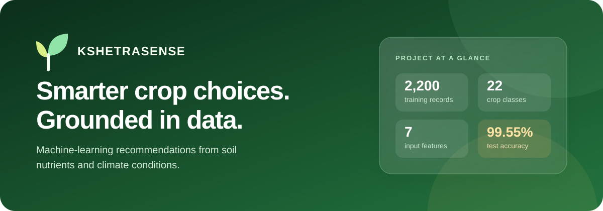
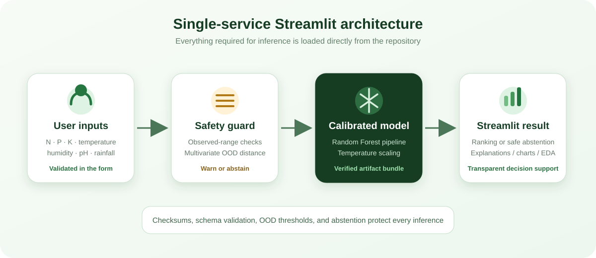
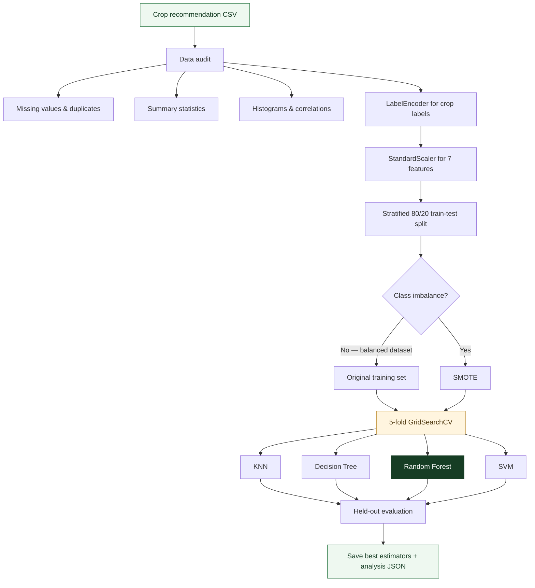
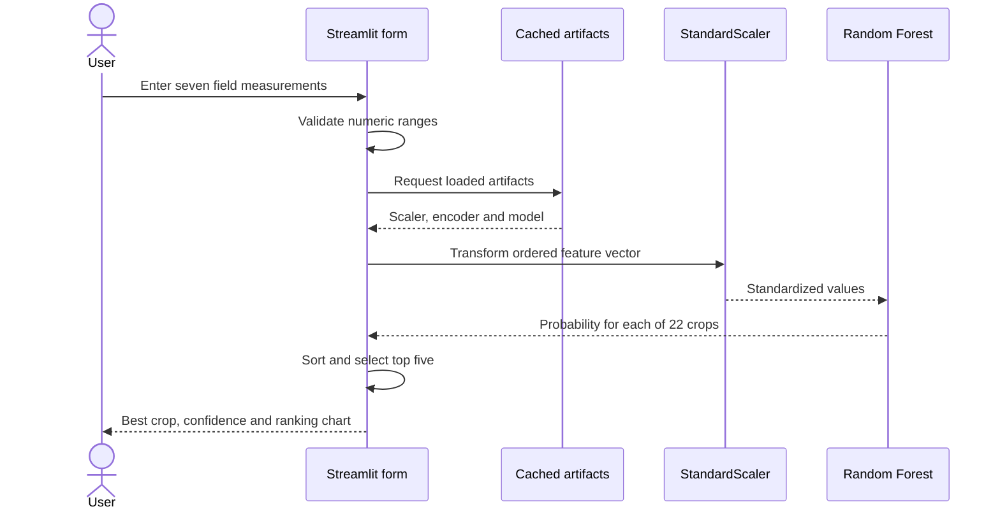

<p align="center">
  
</p>

<p align="center">
  <strong>A machine-learning crop recommendation system that turns soil and climate measurements into ranked crop suggestions.</strong>
</p>

<p align="center">
  
  
  
  
</p>

---

## Project overview

KshetraSense recommends crops from seven measurements describing soil nutrients and recent environmental conditions. A user enters nitrogen, phosphorus, potassium, temperature, humidity, soil pH and rainfall. The application applies the same preprocessing used during training, runs a tuned Random Forest classifier and displays the five most likely crops with confidence scores.

The project covers the complete machine-learning lifecycle:

- dataset inspection and exploratory analysis;
- reproducible preprocessing and label encoding;
- training and tuning four classification algorithms;
- held-out evaluation and cross-validation;
- persisted model and analysis artifacts;
- interactive inference, model comparison and EDA in Streamlit;
- a self-contained deployment with no database or external prediction API.

> KshetraSense is decision-support software. It does not account for every regional, economic or agronomic factor and should complement—not replace—local expert advice.

## Problem statement

Crop selection depends on several interacting factors. Considering one measurement in isolation can lead to a poor recommendation: high rainfall may suit one crop, while the same field's nutrient profile or pH may make another crop more appropriate. KshetraSense frames this as a **22-class supervised classification problem**, learning the relationship between seven numeric inputs and the crop label in the included dataset.

## System architecture

<p align="center">
  
</p>

The deployment is intentionally simple. Streamlit owns the form, model inference, charts and analysis pages. The trained model files are loaded from `models/` and cached once per process, so predictions do not depend on another server.


## Application features

### Crop recommendation

- Seven validated number inputs with useful agricultural units
- Preset example representing rice-like conditions
- Best crop recommendation with model confidence
- Top-five probability ranking for comparison
- Clear note explaining that confidence is not guaranteed yield

### Project overview

- Training sample, crop-class and model-accuracy metrics
- Balanced class-distribution chart
- Plain-language inference pipeline explanation

### Model performance

- Accuracy, precision, recall, F1 and cross-validation results
- Side-by-side classifier comparison
- Random Forest feature-importance chart
- Hyperparameter and evaluation context

### Data explorer

- Interactive feature selection
- Per-feature histograms
- Summary statistics
- Correlation matrix with color encoding

## Input features

| Feature | Meaning | Application range | Dataset range |
| --- | --- | ---: | ---: |
| `N` | Nitrogen content | 0–200 mg/kg | 0–140 |
| `P` | Phosphorus content | 0–200 mg/kg | 5–145 |
| `K` | Potassium content | 0–250 mg/kg | 5–205 |
| `temperature` | Ambient temperature | −10–60 °C | 8.83–43.68 °C |
| `humidity` | Relative humidity | 0–100% | 14.26–99.98% |
| `ph` | Soil acidity/alkalinity | 0–14 | 3.50–9.94 |
| `rainfall` | Rainfall measurement | 0–500 mm | 20.21–298.56 mm |

The broader application ranges allow valid field measurements while preventing obviously malformed input. Predictions far outside the dataset ranges should be treated with extra caution because they are extrapolations.

## Dataset

The included `Crop_recommendation.csv` contains:

| Property | Value |
| --- | ---: |
| Records | 2,200 |
| Numeric features | 7 |
| Crop classes | 22 |
| Records per class | 100 |
| Missing values | 0 |
| Duplicate records | 0 |

The classes are apple, banana, blackgram, chickpea, coconut, coffee, cotton, grapes, jute, kidney beans, lentil, maize, mango, moth beans, mung bean, muskmelon, orange, papaya, pigeon peas, pomegranate, rice and watermelon.

## Machine-learning workflow



### Model selection

Four classifiers were tuned with five-fold stratified `GridSearchCV`. All metrics below come from the committed `model_comparison.json` artifact.

| Rank | Model | Accuracy | Precision | Recall | F1 | CV mean ± std |
| ---: | --- | ---: | ---: | ---: | ---: | ---: |
| 1 | **Random Forest** | **99.55%** | **99.57%** | **99.55%** | **99.55%** | 99.45% ± 0.18% |
| 2 | SVM | 98.86% | 98.97% | 98.86% | 98.86% | 98.64% ± 0.14% |
| 3 | KNN | 98.18% | 98.23% | 98.18% | 98.17% | 98.09% ± 0.95% |
| 4 | Decision Tree | 97.95% | 98.06% | 97.95% | 97.94% | 98.68% ± 0.63% |

Random Forest is used for inference because it achieved the highest held-out accuracy and weighted F1 score. The saved estimator uses 50 trees, unrestricted maximum depth, `min_samples_split=5` and `min_samples_leaf=1`.

### Feature importance

The Random Forest's impurity-based importance ranks the features as follows:

```text
Rainfall     ███████████████████████  23.19%
Humidity     █████████████████████    21.29%
Potassium    ██████████████████       18.51%
Phosphorus   ███████████████          15.04%
Nitrogen     ██████████               10.25%
Temperature  ███████                   6.62%
Soil pH      █████                     5.10%
```

Feature importance describes how the fitted model uses variables; it does not prove that a feature causally changes crop performance.

## Prediction flow



## Repository structure

```text
KshetraSense/
├── app.py                         # Complete Streamlit application
├── requirements.txt              # Deployment dependencies
├── .streamlit/
│   └── config.toml                # Theme and server configuration
├── dataset/
│   └── Crop_recommendation.csv    # Training dataset
├── models/
│   ├── best_rf.pkl                # Production classifier
│   ├── best_dt.pkl                # Tuned Decision Tree
│   ├── best_knn.pkl               # Tuned KNN
│   ├── best_svm.pkl               # Tuned SVM
│   ├── scaler.pkl                 # Fitted StandardScaler
│   ├── label_encoder.pkl          # Crop label mapping
│   ├── eda.json                   # Precomputed EDA data
│   ├── feature_importance.json    # Tree feature importance
│   └── model_comparison.json      # Evaluation results
├── training/
│   ├── train_models.py            # Reproducible training pipeline
│   └── requirements.txt           # Extra training dependencies
└── docs/
    ├── kshetra-sense-banner.svg
    └── system-architecture.svg
```

## Run locally

```bash
python -m venv .venv

# Windows
.venv\Scripts\activate

# macOS / Linux
source .venv/bin/activate

pip install -r requirements.txt
streamlit run app.py
```

Open `http://localhost:8501`.

<<<<<<< HEAD
=======

>>>>>>> 99a9e1a2a1634c0f2398b8859ba17d834061c641
## Retrain the models

The saved models are already included, so retraining is optional.

```bash
pip install -r training/requirements.txt
python training/train_models.py
```

Training regenerates every `.pkl` and `.json` artifact in `models/`. Review the new evaluation results before publishing the regenerated files.

## Technology stack

| Area | Technology |
| --- | --- |
| Interface and deployment | Streamlit |
| Data processing | pandas, NumPy |
| Modeling | scikit-learn, imbalanced-learn |
| Persistence | joblib, JSON |
| Visualisation | Streamlit charts and styled dataframes |
| Runtime | Python 3.11 |

## Limitations and responsible use

- The model reflects patterns in the included dataset and may not generalize equally to every geography or season.
- The input does not include soil type, crop prices, water availability, pest pressure, planting calendar or local regulations.
- Confidence is relative model certainty, not a yield, profit or success guarantee.
- Measurements outside the dataset ranges are extrapolations.
- A local agronomist and current field testing should inform real planting decisions.

## License

Copyright © 2026 Saanvi. All rights reserved.

This is proprietary software. Copying, modification, redistribution, hosting, deployment, commercial use, and derivative works are prohibited without prior written permission. See the [LICENSE](LICENSE) file for the complete terms.

Third-party libraries and any externally sourced dataset material remain subject to their respective owners' rights and license terms.
