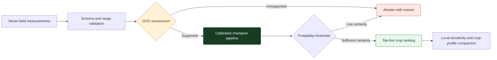
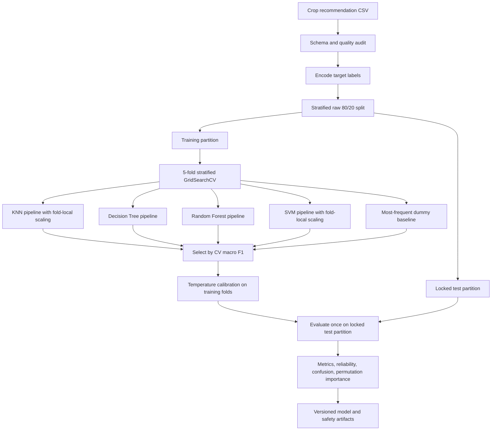

<p align="center">
  
</p>

<p align="center">
  <strong>A guarded machine-learning system that turns soil and climate measurements into ranked crop suggestions.</strong>
</p>

<p align="center">
  
  
  
  
</p>

## What Kshetra Sense does

Kshetra Sense is a multiclass crop recommendation project built around seven measurements: nitrogen, phosphorus, potassium, temperature, humidity, soil pH, and rainfall. It returns a five-crop shortlist only when the submitted field profile is sufficiently similar to the model's training data and the leading calibrated probability clears a safety threshold.

The project is designed as transparent decision support rather than an agronomic authority. Alongside the recommendation UI, it exposes exploratory analysis, model-selection evidence, calibration quality, labelled confusion data, per-crop metrics, permutation importance, local sensitivity, artifact diagnostics, and a workflow for evaluating genuinely external labelled data.

> The model does not estimate yield, profit, disease risk, planting date, or causal treatment effects. It has not yet been validated prospectively across farms, regions, or seasons.

## System architecture

<p align="center">
  
</p>



The application loads one combined, calibrated pipeline. A manifest pins the feature order, class vocabulary, package versions, dataset hash, artifact hashes, confidence threshold, and auxiliary profile files. Startup fails rather than silently serving a modified or incompatible artifact.

## Machine-learning workflow

The training program protects the final test set from both preprocessing and model-selection leakage.



Important controls:

- preprocessing lives inside each estimator pipeline;
- model selection uses only training-fold macro F1;
- the holdout is opened once after the champion and hyperparameters are fixed;
- a dummy classifier anchors the comparison;
- probabilities are calibrated with multiclass temperature scaling;
- bootstrap intervals communicate sampling uncertainty;
- exact ranges plus Mahalanobis distance detect unsupported inputs;
- the deployed system may abstain instead of forcing a crop prediction.

## Dataset

The included dataset contains 2,200 complete rows and 22 crop classes, with 100 records per crop.

| Feature | Meaning | Observed dataset range |
| --- | --- | ---: |
| `N` | Nitrogen content | 0–140 |
| `P` | Phosphorus content | 5–145 |
| `K` | Potassium content | 5–205 |
| `temperature` | Ambient temperature | 8.83–43.68 °C |
| `humidity` | Relative humidity | 14.26–99.98% |
| `ph` | Soil acidity or alkalinity | 3.50–9.94 |
| `rainfall` | Rainfall measurement | 20.21–298.56 mm |

The labels are apple, banana, blackgram, chickpea, coconut, coffee, cotton, grapes, jute, kidney beans, lentil, maize, mango, moth beans, mung bean, muskmelon, orange, papaya, pigeon peas, pomegranate, rice, and watermelon.

The dataset contains no farm identifier, geography, timestamp, season, crop variety, yield, price, irrigation constraint, or outcome after recommendation. Those omissions limit which scientific claims the project can support.

## Model selection and final evaluation

Candidate models were ranked by five-fold macro F1 on the 1,760-record training partition.

| Model | CV macro F1 | CV balanced accuracy | CV accuracy |
| --- | ---: | ---: | ---: |
| **Random Forest** | **99.49%** | **99.49%** | **99.49%** |
| Decision Tree | 98.58% | 98.58% | 98.58% |
| SVM | 98.57% | 98.58% | 98.58% |
| KNN | 97.54% | 97.56% | 97.56% |
| Dummy baseline | 0.40% | 4.55% | 4.55% |

After selection, the Random Forest pipeline was calibrated and evaluated once on 440 untouched records.

| Final holdout metric | Result |
| --- | ---: |
| Accuracy | 99.55% |
| Accuracy 95% bootstrap interval | 98.86–100.00% |
| Balanced accuracy | 99.55% |
| Macro precision | 99.57% |
| Macro recall | 99.55% |
| Macro F1 | 99.55% |
| Macro F1 95% bootstrap interval | 98.81–100.00% |
| Top-3 accuracy | 100.00% |
| Log loss | 0.0157 |
| Multiclass Brier score | 0.0091 |
| Expected calibration error | 0.47% |

These are internal estimates from a random stratified split, not external or prospective evidence. The narrow result is partly enabled by a clean, balanced dataset whose classes are highly separable.

## Explainability and input safety

Global reliance is measured with permutation importance on the untouched test set using macro F1. The strongest signals in the current artifact are humidity, nitrogen, rainfall, potassium, and phosphorus. Unlike impurity importance, this method can be applied consistently to the full calibrated estimator, but it still does not establish causation.

For an individual recommendation, the application shows:

- the change in top-crop probability when each feature is replaced by its training mean;
- the input's distance from the predicted crop's average profile;
- whether individual features are outside observed or central training ranges;
- the multivariate Mahalanobis distance from the training distribution;
- a warning or abstention when the input lacks sufficient model support.

## Application workspace

| Page | Purpose |
| --- | --- |
| **Recommend** | Stylish field-input console, guarded inference, calibrated ranking, explanations, and safe abstention |
| **Overview** | System scope, class coverage, inference stages, and validation limitations |
| **Model performance** | CV comparison, baseline, bootstrap intervals, calibration, confusion matrix, per-class metrics, external CSV validation, and artifact diagnostics |
| **Data explorer** | Interactive distributions, crop comparisons, descriptive statistics, relationships, and correlations |
| **Jupyter notebook** | Corrected executable workflow plus the full app, training program, and inference core source |

## External validation contract

Genuine external validation requires a CSV collected from a different geography, season, farm group, or measurement process. It must contain:

```text
N, P, K, temperature, humidity, ph, rainfall, label
```

The validation workspace checks the schema and labels, scores accuracy, balanced accuracy, macro precision/recall/F1, top-3 accuracy, and log loss, measures the OOD rate, and returns downloadable row-level predictions. It never retrains the deployed model on the uploaded file.

## Repository map

```text
KshetraSense/
├── app.py                         Streamlit workspace
├── ml_core.py                     Framework-independent inference and safety layer
├── requirements.txt               Pinned runtime dependencies
├── requirements-dev.txt           Test dependencies
├── dataset/
│   └── Crop_recommendation.csv
├── models/
│   ├── champion_pipeline.pkl       Calibrated deployable estimator
│   ├── label_encoder.pkl           Crop vocabulary
│   ├── manifest.json               Schema, versions, hashes, thresholds, metrics
│   ├── ood_profile.json            Ranges and multivariate novelty thresholds
│   ├── crop_profiles.json          Per-crop feature reference profiles
│   ├── model_comparison.json       CV selection and final evaluation evidence
│   ├── feature_importance.json     Permutation importance
│   └── eda.json                    Precomputed exploratory summaries
├── notebooks/
│   └── kshetra_sense.ipynb         Reproducible corrected workflow
├── training/
│   └── train_models.py             Leakage-free training and packaging
├── tests/                           Artifact, inference, OOD, validation, and app tests
├── .github/workflows/ci.yml         Automated syntax and test checks
└── docs/                             Project visuals
```

## Limitations and next steps

- Validate prospectively across farms, agro-climatic zones, and multiple seasons.
- Add farm, region, time, variety, soil texture, irrigation, cost, market, pest, and yield outcomes.
- Replace the random split with group-aware and time-aware validation once those identifiers exist.
- Define agronomist-reviewed action thresholds and measure the effect of abstention on coverage and error.
- Log privacy-preserving production inputs, OOD status, probability, and later outcomes to detect drift and performance decay.
- Evaluate fairness and coverage by geography, farm scale, measurement device, and underrepresented operating conditions.
- Treat recommendations as one input to a human agronomic decision, never as an autonomous planting instruction.

## License

Copyright © 2026 Saanvi. All rights reserved.

This is proprietary software. Copying, modification, redistribution, hosting, deployment, commercial use, and derivative works are prohibited without prior written permission. See [LICENSE](LICENSE) for the complete terms. Third-party libraries and externally sourced data remain subject to their respective owners' terms.
